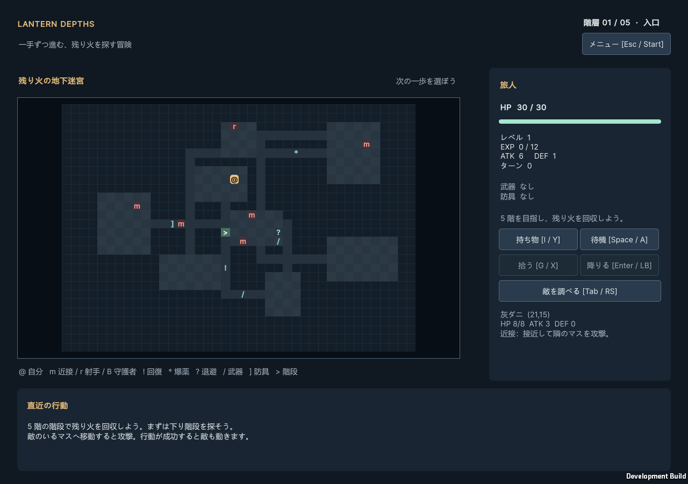

# Lantern Depths

Unity 6000.3.22f1 / C# による、5階で完結するオリジナルの2Dターン制ダンジョン探索ゲームです。
既存作品のキャラクター・名称・画像・音楽は使用していません。



近接・射手・最終階守護者、退避と範囲攻撃、装備比較、日本語/英語、初回ガイド、操作・文字・音量・画面設定、冒険記録と旧セーブ移行を実装済み。Windows版は `Builds/Windows/LanternDepths.exe` から起動できます。
実行ファイルを移す場合は、隣の`LanternDepths_Data`、`MonoBleedingEdge`、DLL等を含む`Windows`フォルダー全体を移してください。
ビルド時にプレイヤー向け`READ_ME.txt`、`CREDITS.txt`、Unityの第三者通知原文、`BUILD_INFO.txt`を同梱します。
配布用ZIPは `Builds/LanternDepths-Windows.zip`。更新時はビルド成功後に`Compress-Archive -LiteralPath Builds/Windows -DestinationPath Builds/LanternDepths-Windows.zip -Force`で再作成できます。

## 起動

1. Unity Hubで本フォルダーを追加し、6000.3.22f1で開きます。有効なEditorライセンスが必要です。
2. `Assets/Game/Scenes/Main.unity` を開いてPlayを押します。
3. Windowsビルドは `Lantern Depths > Build Windows`。出力は `Builds/Windows/LanternDepths.exe` です。

## 追加機能（1.1）

- 敵をクリックまたはTab/右スティック押し込みでHP・攻撃・防御・特性を確認。
- 射手は射程4と後退、最終階の守護者は予告してから強打。階ごとに敵構成と追加道具が変化。
- 退避ルーン、爆薬瓶、攻防に交換条件のある大剣と鎧。持ち物は種類順、装備比較は実際の能力差。
- メニューの「設定・遊び方・記録」から言語・文字サイズ・効果音・全画面・キー割り当てを変更。
- 直近1000冒険の記録と200行の行動履歴を保存。旧形式1の実セーブで形式2への移行を検証。
- 詳細は [プレイヤー案内](docs/PLAYER_GUIDE.txt)。

## 操作

| 行動 | キーボード | Xbox形式ゲームパッド |
|---|---|---|
| 8方向移動・隣接敵への攻撃 | テンキー1〜9（5以外）、矢印/WASD、斜めQ/E/Z/C | 左スティック/D-pad |
| 足踏み | Space / テンキー5 | A |
| 足元の品を取得 | G | X |
| 所持品の開閉 | I、閉じる場合Esc | Y / B |
| 階段を降りる | Enter | LB |
| 最終階の階段で宝火を回収してクリア | Enter | LB |
| 所持品の選択 | 上下矢印 / クリック | スティック/D-pad上下 |
| 選択品を使用 | U | A |
| 選択品を装備・解除 | E | X |
| 選択品を捨てる | D | RB |
| 死亡・クリア後に新規探索 | R | メニューから選択 |
| メニュー（保存・終了・新規探索・設定・操作説明） | Esc | Start |
| ターン演出の切替 | F | Back |

1回押すと1行動。スティックは倒し直して次の行動を入力します。
標準Input Managerを使用します。上記ゲームパッド割当はWindowsのXbox形式向けで、他形式はInputManager/PlayerInputAdapterで調整が必要です。入力値注入によるテストは成功していますが、物理コントローラーの接続検証は未実施です。

## ルール

- 成功した移動、攻撃、待機、取得、使用、破棄、装備・解除は1ターン。
- UI開閉、選択、壁への移動、満杯や不正対象で失敗した操作は0ターン。
- 斜め移動・攻撃は縦横どちらかの隣接地形が壁なら不可。
- 階段使用は1ターン。旧階・新階の敵はそのターンに行動しません。
- 目標は5階の守護者を倒し、階段で残り火を回収すること。結果画面から再挑戦できます。最終階はGameRulesのFinal Floorで変更できます。
- 回復品はHP満タンなら消費しません。装備品も所持上限20枠に含みます。
- 階移動ではHP・EXP・レベル・所持品・装備が維持されます。
- 死亡・クリア後は操作停止。再挑戦すると探索状態が初期化されます。
- 成功した行動ごとに自動保存します。次回起動時は前回の探索・結果画面から再開します。
- 全マップ表示。空腹・状態異常・視界制限は今回の実装対象外です。

## 構成と調整

- `Scripts/Domain`: Unity非依存。状態、行動、ターン、戦闘、生成、AI、アイテム。
- `Scripts/Content`: ScriptableObjectから不変のDomain定義へ変換。
- `Scripts/Presentation`: 入力、UI Toolkit描画、イベント演出、HUDと所持品画面。
- `Data/GameRules.asset`: マップ寸法、敵数、初期能力、累積EXP閾値と成長量。
- `Data/EmberTonic.asset`、`CopperEdge.asset`、`WovenGuard.asset`: 回復・武器・防具の定義。個体は`ItemInstance`。
- `UI/Game.uss`: 色・文字・レイアウト。

ターン処理は `PlayerCommand → ActionResolver → 敵ID順にAI/Resolver → TurnEndProcessor`。
表示側は返されたイベントを順に再生し、その間は追加行動を拒否します。
表示中断時は最終状態から描画を復元します。Domainは演出待ちに依存しません。

生成とAIは `IDungeonGenerator` / `IEnemyBrain` を差し替え可能。
乱数は保存可能な状態を持つ探索単位の`RunRandom`。MainシーンのBootstrapで`Use Fixed Seed`を有効にすると再現できます。
同じコード・設定・Seed・コマンド列での再現を想定し、バージョンをまたぐ互換性は保証しません。セーブ導入以前のSeedとは配置が変わります。

## 保存と終了

メニューはEsc / Startで開きます。上下矢印 / D-padで選び、Enter / Aで実行、Esc / Bで確認を取り消します。
「保存して終了 / Save and quit」で保存して終了。「Begin a new descent」は確認後に現在の探索を置き換えます。
死亡・クリアの結果も保存するため、再起動で死亡前に戻ることはありません。

Windowsの保存先は `%USERPROFILE%/AppData/LocalLow/LanternWorks/Lantern Depths/`（UnityのpersistentDataPath）。
`run.sav`が現在の探索、`run.sav.bak`が前回の異なる保存、`settings.dat`が演出設定です。`preferences.json`に表示・音量・キー設定、`history.json`に冒険結果と行動履歴を保存します。
同じ保存先を複数のゲームが同時に開くことを防ぎます。`session.lock`ファイルは終了後も残りますが、実行中だけOSのファイルロックを保持します。
Editorでは`Editor`サブフォルダー、テストでは専用フォルダーを使用します。
保存対象は階・地形・敵・HP・成長・所持品・装備・ターン・乱数状態です。直近200行の行動履歴はhistory.jsonに保存して再開時に復元します。

保存失敗時は現在の探索をメモリーに残し、メニューに表示します。「Save now」で再試行できます。
読み込めない保存は黙って上書きしません。「Restore previous save」でバックアップへ戻すか、新規探索を確認して開始します。
形式1の旧保存は形式2へ移行します。未知の形式・異なるゲーム設定は拒否します。更新前に保存ファイルを手元へコピーしておくと、旧版で再開できます。

## 検証

```powershell
# Unityを起動せず、共通EditModeテストを.NET 8で実行し、Unity実DLLでC#コンパイル
pwsh -File Tools/Verify.ps1

# Editorライセンス有効化後：Unity EditMode/PlayModeテストも実行
pwsh -File Tools/Verify.ps1 -Unity

# Windowsビルドも実行
pwsh -File Tools/Verify.ps1 -Unity -Build
```

Unityのインストール先が異なる場合は`-UnityEditor '.../Editor/Unity.exe'`を指定してください。
.NET経由のコンパイルはUnityのインポート・シリアライズ・実行検証の代わりにはなりません。
TestResultsにはTRX/XML、Unityログ、PlayModeの画面キャプチャが出力されます。
画面キャプチャテストはbatchmodeではスキップします。EditorでGameビューを表示してTest Runnerから実行してください。

現時点の検証結果と残作業は [docs/IMPLEMENTATION_STATUS.md](docs/IMPLEMENTATION_STATUS.md) に記録しています。
